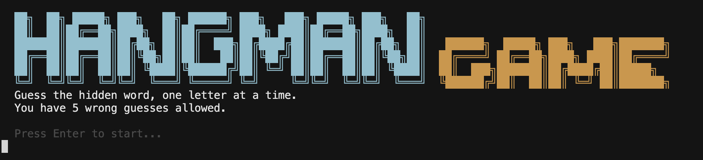

# Hangman Game

Console hangman written in **C#** and **.NET**. Guess the hidden word letter by letter — you have a limited number of wrong tries before the game ends.

> Semester project · C# learning · clean project structure

---

## Screenshots

| Welcome screen | Gameplay |
|:---:|:---:|
|  |  |

---

## Features

- **ASCII UI** with colors — banner, gallows, word box, mistake tracker
- **Random words** loaded from `Data/words.txt`
- **Game state** — win / lose / in progress (`GameResult`)
- **Mistake limit** — configurable wrong guesses (`Mistakes`)
- **Separated concerns** — logic, UI, and data in different folders

---

## How to play

1. Run the game (`dotnet run`).
2. Press **Enter** on the welcome screen.
3. Type **one letter** and confirm with Enter.
4. Guess the whole word before you run out of mistakes.

---

## Requirements

- [.NET SDK 10.0](https://dotnet.microsoft.com/download) or newer

Check your version:

```bash
dotnet --version
```

---

## Quick start

```bash
git clone <your-repo-url>
cd wisielec_game
dotnet run
```

Build only:

```bash
dotnet build
```

---

## Project structure

```
wisielec_game/
├── Data/
│   ├── WordRepo.cs       # loads words from file, random pick
│   └── words.txt         # word list (one word per line)
├── Game/
│   └── wisielec_engine.cs  # game logic (Hangman engine)
├── Models/
│   ├── GameResult.cs     # win / lost / in_progress
│   └── Mistakes.cs       # mistake counter
├── UI/
│   └── ConsoleRenderer.cs  # console display & input
├── screenshots/
│   ├── main.png
│   └── image copy.png
├── Program.cs              # entry point
└── Wisielec.csproj
```

| Layer | Responsibility |
|-------|----------------|
| `Game/` | Rules: letters, win/lose, game loop |
| `UI/` | Display only: banner, gallows, prompts |
| `Data/` | Words: load file, `GetRandomWord()` |
| `Models/` | Small types shared across the app |

---

## Adding new words

Edit `Data/words.txt` — **one word per line**, lowercase, no spaces:

```text
toyota
programming
hangman
computer
car
```

After `dotnet build`, the file is copied to the output folder automatically (`Wisielec.csproj`).

---

## Tech stack

- **Language:** C# 13 / .NET 10
- **Type:** Console application
- **Architecture:** simple layered structure (no external packages)

---

## Author

**Marcin Pawlak** — C# learning project (SEM 3)

---

## License

Educational project — free to use for learning.
